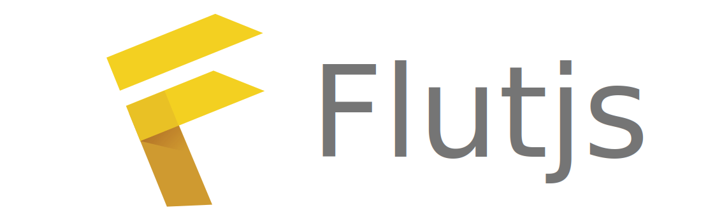

# Welcome to Flutjs project 😀

Flutjs is a javascript framework for creating beautiful, fast and lightweight websites.
As the name suggests, Flutejs is based on Flutter for its simplicity and easy learning curve and the ability to easily extend.

## Getting Stated:

To get start with Flutjs just follow the steps below:

### With Nodejs:

1 - Install the latest version of Nodejs.

2 - Start new nodejs project

  `npm init`

3 - Install Flutjs with npm or yarn:

>npm

`npm i @luk3d/flutjs`
>yarn

`yarn add @luk3d/flutjs`

Congrats!! 🎉 You have Installed Flujs successfully on your project. Now jump to hello world section the create a simple Flutjs website/webApp.


### On Browser:

Coming soon....

Add this link to the header tag of your html page:
```html
<script type="moduel" src="https://cdn.jsdelivr.net/npm/@luk3d/flutjs@0.2.0/dist/flutjs.min.js"></script>
```
>NOTE: you need to check the latest vesio here:
[Flutjs Latest](https://www.jsdelivr.com/package/npm/@luk3d/flutjs?path=dist)


## Hello World App: ⚡

```js
/**Basic Flutjs App With Tailwind */
import { Expanded, Padding, Column, Container, Text, Colors, EdgeInsets, MainAxisAlignment, CrossAxisAlignment, TextStyle } from "./index.js";
import { Scaffold, WindiApp, AppBar } from "./windiapp/index.js";

WindiApp({
  title: "Flutjs test",

  home: Scaffold({
    appBar: AppBar({
      backgroundColor: Colors.Blue[500],
      foregroundColor: Colors.Gray[100],
      title: Text("Welcome to Flutjs"),
      elevation: 2,
    }),
    body: Expanded({
      child: Container({
        color: Colors.Gray[50],
        child:
          Padding({
            padding: EdgeInsets.all(10),
            child: Column({
              mainAxisAlignment: MainAxisAlignment.center,
              crossAxisAlignment: CrossAxisAlignment.center,
              children: [
                Text("Hello World"), Text("🤩", {
                  textStyle: TextStyle({ fontSize: 20 })
                })
              ],
            }),
          }),
      }),
    }),
  }),
});
```

> NOTE: Just like in Flutter, every component is a widget...


## UPDATES TABLE 🚀

Date | Updates|
-|-|
 19-02-2022| `Text Widget` now supports `textStyle` property. Once compiled all values added on the textStyle attr will be translated to css attr of the text element |
 16-02-2022| The `App Widget` now fills the width and height of the screen by using 100% of `vw` and `vh` `css` units |
 16-02-2022| The `Extended Widget` now replaces himself with his child once compiled |
 16-02-2022| `Width` and `Height`  Where added on the widget constructor. |
 16-02-2022| Html output improvement |

  

## Under Development:🚧

- A Set of widgets like Material Design components.
- Route management
- State management
- Decorations (TextStyle, BoxDecoration etx...)
- Icons Library..
- Routing
- Custom cli tool for fast project creation.
- VsCode Extension for auto completion and snippets for fast coding...
